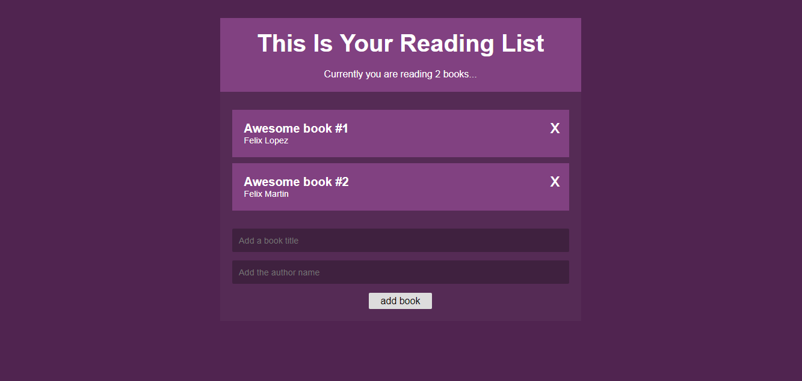

# React Book List App

App made in the net ninja's series about react context API and hooks [link](https://www.youtube.com/watch?v=6RhOzQciVwI&list=PL4cUxeGkcC9hNokByJilPg5g9m2APUePI)

## [Live Demo](https://fx-booklistapp.netlify.com/)



## Installation
```sh
  git clone https://github.com/facodes/react-booklist.git
  cd react-booklist
  npm install
  
  npm run start # runs the app on localhost:3000

```
